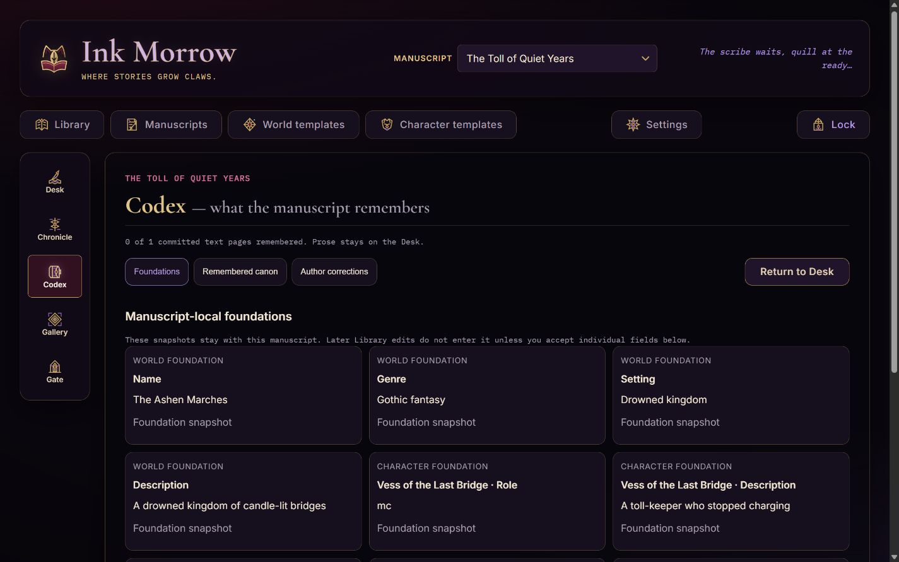
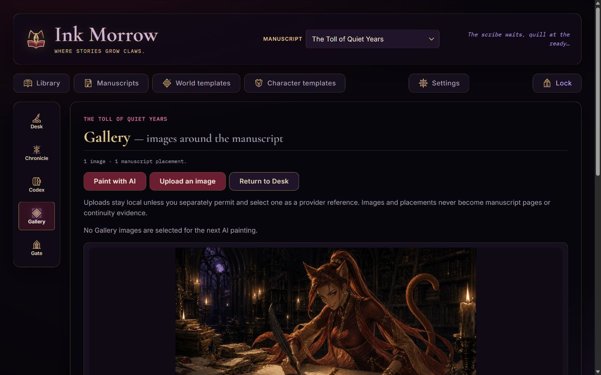

<p align="center">
  
</p>

<h1 align="center">Ink Morrow</h1>

<p align="center"><strong>A self-hosted gothic writing room for long-form fiction.</strong><br>Build reusable worlds and casts, write one page at a time, keep continuity inspectable, illuminate the manuscript, and decide exactly how it leaves.</p>

<p align="center">
  
  
  
  
</p>

<p align="center">
  <a href="#quick-start">Quick start</a> ·
  <a href="docs/user-guide/Ink-Morrow-4.0-User-Guide.pdf">User guide</a> ·
  <a href="#screenshots">Screenshots</a> ·
  <a href="docs/releases/4.0.0/OPERATIONS.md">Operations</a> ·
  <a href="SECURITY.md">Security</a> ·
  <a href="CONTRIBUTING.md">Contributing</a> ·
  <a href="docs/releases/4.0.0/KNOWN-ISSUES.md">Known limits</a>
</p>

Ink Morrow is an interactive-fiction authoring tool with reusable worlds and
characters, a gothic web interface, and catgirl scribes. A manuscript advances
**one page at a time**: you give the page a direction, the Scribe writes it,
then waits for you.

Its real advantage is the collaboration: the human author supplies intent,
taste, constraints, revision, and the final word on canon, while AI accelerates
drafting, continuity extraction, illustration, and narration. Ink Morrow can
still be used for manual writing and local project care, but that resilience is
not the product's center—the directed human/AI loop is.

> [!IMPORTANT]
> **Ink Morrow 4.0.0-beta.1 is a clean-break beta.** Start it with a new,
> empty `DATA_DIR`. It deliberately refuses 3.x databases and format-v1
> archives before writing. Keep the historical 3.2.2 build and its data intact for
> historical work; there is no in-place migration.

The beta ships the complete 4.0 Scriptorium: Library manuscript start/import,
the Desk, Chronicle, Codex, Gallery, Gate, immutable revisions and recovery,
transactional prepared-page writing, page-provenanced continuity, safe image
upload, multi-format publication, encrypted provider credentials, portable
`.inkmorrow` v2 backups, and immutable revocable reading snapshots. The
authenticated `/api/capabilities` endpoint reports the release, database,
archive, and feature identities used by the running server.

The 4.0 release history is licensed `AGPL-3.0-only`; versions through 3.2.2
remain MIT-licensed in the preserved historical first-parent line. The accepted
product, architecture, security, UX, art, and QA record is indexed in
[docs/releases/4.0.0/](docs/releases/4.0.0/). Operational setup, clean-break
installation, backup, restore, and sharing guidance is in
[docs/releases/4.0.0/OPERATIONS.md](docs/releases/4.0.0/OPERATIONS.md), with
current beta limits in
[docs/releases/4.0.0/KNOWN-ISSUES.md](docs/releases/4.0.0/KNOWN-ISSUES.md).

The task-oriented [Ink Morrow 4.0 User Guide](docs/user-guide/Ink-Morrow-4.0-User-Guide.pdf)
explains the main authoring flows with the approved interface and branding.

> [!NOTE]
> **How the 4.0 beta was made:** the clean-break refactor from the earlier
> application was produced exclusively through ChatGPT/Codex under human-led
> feature planning, direction, review, and acceptance. That work includes the
> 4.0 implementation, visual-asset generation, and documentation generation.
> The historical through-3.2.2 line has different development credits; see
> [CREDITS.md](CREDITS.md) for the complete boundary.

<details>
<summary><strong>Historical 3.x release context</strong></summary>

The current beta is documented above. These notes explain the preserved 3.x
first-parent history; the complete record lives in [CHANGELOG.md](CHANGELOG.md).

**v3.2.2** repairs the prepared-page pipeline. Pressing the green button now commits the prose that is already waiting and displays it before continuity extraction finishes; it can never fall through to a second live generation of that page. Exactly one successor is still prepared behind the reader after every successful write, rewrite, or prepared commit, preserving instantaneous direction-free page turns without duplicate spend.

Prepared pages now carry opaque identities, stale provider replies cannot overwrite newer previews, and a free metadata read restores the green button after refresh. While preparation is in flight the empty-direction button says so and cannot launch a competing write; canceling a directed write keeps the paid preview. Live writes and rewrites revalidate their story snapshot after the provider returns, story-load and generation tokens prevent late responses from painting the wrong manuscript, and async continuity costs stay attached to the story that started them.

**v3.2.1** seals each installation for one local owner. On first launch, the server prints a one-time setup code; the browser uses it to set a password or passphrase before any manuscript API or private screen can load. Later visits unlock with that password. **Lock** revokes the current server-side session, changing the password revokes every other session, and a terminal-only recovery command removes the password without touching stories or assets.

The boundary is deliberately small and local-machine friendly: asynchronous scrypt password hashing, random opaque sessions stored only as hashes, HttpOnly/SameSite cookies, per-session CSRF tokens, same-origin and Host/DNS-rebinding checks, login throttling, bounded request bodies, private caching, sanitized provider errors, restrictive browser headers, local-only binding by default, and private database/config permissions. Fonts are bundled, so the sealed screen makes no third-party typography request. This is access control—not disk encryption: the database, media, and portable archives remain readable to anyone who can read those files. See [SECURITY.md](SECURITY.md) for the exact boundary and safe LAN/HTTPS setup.

**v3.2.0** adds versioned, dependency-aware portable archives and complete local backups. A character travels with their home world; a world export can include none, some, or all residents; a story always carries its world, complete current cast (including external home worlds), pages, frozen snapshots, and continuity; a full backup carries everything plus a strict device-settings whitelist. Paintings, audiobook audio, and working history are explicit switches, with audio always called out because it can dominate file size. Every export gets an exposure review and streams media from disk without calling an AI provider.

Imports are staged and SHA-256 verified before the first write. Identical content is reused, same-name items are warned about, and same-ID differences offer keep local / import copy / replace local—stories are never silently field- or page-merged. Copying remaps the complete dependency graph and page-linked state; commit is transactional across SQLite and media files. A replace-all restore first creates a downloadable safety backup of the current installation. Login credentials never enter an archive; archive encryption remains deliberately reserved for a later release. The format, privacy boundary, collision grammar, and recovery behavior are documented in [docs/portable-archives.md](docs/portable-archives.md).

**v3.1.0** adds a page-provenanced continuity ledger for long-form stories. Every committed text page gets a separate, strictly structured memory delta: durable events, character location/condition/knowledge/possessions, goals, threads, and story facts. The author model receives a frozen casting snapshot, current folded state, bounded recent prose, and relevant older memories; character/world-sheet intentions are explicitly reference data rather than commands. Prepared pages remain completely inert until committed. Deleting a page removes its facts, regeneration excludes the old page while writing and replaces its delta only after successful prose generation, and the remaining ledger replays deterministically without another AI call.

Library → Stories now exposes that ledger alongside each manuscript's assets. Existing pages are never surprise-backfilled: missing or failed memory can be built or rebuilt one page at a time with an informed cost review and recoverable progress. Authors can inspect current state and events, correct character location/condition, and override goal/thread status. The implementation stays friendly to low-powered local machines: no embeddings, vector server, local model, background polling, or whole-story AI replay—only bounded prompts, indexed SQLite/FTS (with a LIKE fallback), and small JSON folds.

The exact data layers, commit/regeneration/delete semantics, extraction contract, and performance limits are documented in [docs/continuity-ledger.md](docs/continuity-ledger.md).

**v3.0.5** turned Library → Stories into the manuscript catalogue without adding a duplicate top-level destination. Story creation moved to the writing desk and restored the explicit maturity choice. Each story card carries a cast-and-world cover, prose excerpt, page/maturity context, and measured media footprint; opening it reveals one place to download or delete its EPUB, cover, audiobook, and painted plates, or repaint the cover. Settings shows reasoning for the server-default model and builds its effort choices from that model's declared OpenRouter capabilities—including `minimal`, `xhigh`, `max`, or `none` when supported—instead of assuming a fixed low/medium/high trio.

**v3.0.4** makes cost consent quiet after the first informed choice. Accepting one paid-action review is remembered on that device (until its site data is cleared), so later writing, narration, drafting, and painting actions run without repeated approval modals. Missing catalogue prices now use conservative ballparks—about $0.02 per text-generation call and $0.05 per narration page—instead of withholding a number. Modal content and cost rows are left-aligned; headings may keep their centered ornamental treatment.

**v3.0.3** makes character and cast maintenance dependable. A character's world can now be changed—or cleared—from the Edit character dialog, and an ordinary save never repaints the portrait; repainting remains an explicit paid action. Both story creation and the running-story Cast editor are regression-covered for Supporting and Background additions, including their story-specific connections. Security and import/export remain deliberately deferred.

**v3.0.2** fixes story casting and makes paid work materially more honest. Supporting and background characters can now be added reliably even while portrait polling refreshes the catalogue, and their roles are visible before creation. Quality retries are accumulated into usage and cost, failed billable attempts reach the session ledger, rewrite sessions book the full new spend, and a failed write never launches a speculative successor. Paid reviews disclose both the normal two-call write flow and a bounded retry ceiling. Cold Write links and asynchronously loaded narrator summaries now render truthful state immediately. Security and import/export remain deliberately deferred.

**v3.0.1** was the first correctness patch over the v3.0.0 ground-up reorganization: page deletion renumbers transactionally, the original explicit paid-action reviews were introduced (later made one-time in v3.0.4), the writing desk is truthful when no story is selected, all dialogs share one complete focus/scroll/opener lifecycle, Home's guidance cards and the themed controls render as designed on every viewport, and the dormant auth seam can actually hold rendering back (still no login system — security remains deferred).

**v3.0.0** was the ground-up reorganization itself: a modular backend (feature routers + stores), a native-ES-module frontend with hash routing and a shared dialog system, a Home/Library/Write information architecture, explicit centered/ensemble cast shapes, and honest cost-bearing buttons everywhere — with every API route, data schema, and cost guarantee preserved.

</details>

**Ink Morrow is not an erotic-writing tool.** It's a story engine, and its heart is biased toward fantasy — swords, sorcery, shadows, and strange worlds. Mature content is possible if you choose that tone for a story, but that's a setting you control, not the point of the tool.

> [!WARNING]
> **Costs real money — set a spending limit on your API key first.**
>
> Ink Morrow attempts to predict and meter **every** cost involved: pages, retries, narration, reference portraits, world scenes, and scene paintings all carry live estimates and per-generation accounting in the cost ticker. But it is **impossible to make guarantees** — upstream prices change without notice, providers meter their own way, retries happen, and estimates are estimates.
>
> The only real safety is upstream of this app: **create a dedicated OpenRouter API key and set a hard spend limit on it** (OpenRouter lets you cap a key's credit) before you put it in `backend/.env`. Treat anything this app reports as a good-faith tally, not an invoice.

> [!CAUTION]
> **OpenRouter is the only AI supplier tested with Ink Morrow.** Other
> OpenAI-compatible endpoints may lack compatible model discovery, image
> generation, narration, reasoning controls, or may not work at all. Local
> project operations can continue without a supplier, but the intended creative
> workflow is human-led, AI-collaborative writing.

## Screenshots

| Home (desktop) | Writing desk (desktop) |
|---|---|
|  |  |

| Home (tablet portrait) | Writing desk (tablet portrait) |
|---|---|
|  |  |

| Library | Worlds |
|---|---|
|  |  |

| Codex | Gallery |
|---|---|
|  |  |

## Features

- **Human-led, AI-collaborative writing** — every page stops for your direction and judgment; the Scribe accelerates the next move while you retain authorship and the final word on canon
- **Prepared next page** — after every successful write, rewrite, or prepared commit, exactly one successor is quietly prepared and its provider cost enters Session immediately. An empty Write commits the identified prose instantly and starts the following preview behind the reader; a confirmed direction replaces it, while canceling keeps it. Prepared prose has no continuity state until committed
- **Retry last page** — regenerate with the same direction but fresh ink
- **Worlds & characters as first-class, reusable entities** — build a cast once, use it across stories; cross-world casting is supported
- **Explicit cast shapes** — every story declares itself *Centered on a lead* or an *Ensemble* up front, in creation and mid-story editing alike; relation labels follow the named lead (and never mention one that does not exist), the mid-story editor offers direct **Make lead / Switch to ensemble** actions, and an empty cast can add a lead directly — never add-then-promote
- **Cast editing mid-story** — the Library's story cards open a roster/details editor: the roster lists members with roles and cross-world provenance; the selected member edits role, starting connection, and explicit manual story overrides. Dirty drafts guard every close, role changes never dump focus or discard local edits, and the reusable catalogue sheets stay untouched
- **Long-form continuity** — casting freezes manuscript-local character sheets; world fields remain live until the author pins individual fields in Codex. Each committed page contributes a separately extracted, page-linked delta. Character state folds together with goals, threads, world facts and durable events. Versioned author canon can add world events, facts, relationships, goals, rules, or custom truths without rewriting prose or extracted evidence
- **AI fleshing-out** — generate worlds and characters from a few seed words, short/medium/long, regenerate for different takes, edit before saving
- **Reference images** — every world gets a painted establishing scene (no people, no creatures, no action) and every character a reference portrait, generated in the background; existing entries are backfilled on boot, regeneration (with its approximate cost) sits in each card's **More** menu, and creation offers both *Create and paint (≈$…)* and *Create without image*
- **Manuscript catalogue and covers** — Library → Manuscripts shows every manuscript with a vertical cover painted from its world and cast, its first prose excerpt, maturity/page context, and the media space it actually uses. Old or deliberately unpainted manuscripts get an honest empty-cover state and an explicit paid Paint action; opening the card manages that manuscript's EPUB, cover, audiobook, and art in one place
- **Card editors** — click a world or character to edit it: plain fields, no AI assists, plus the editable blurb sent to the image generator. Worlds carry a **lorebook** — canonical facts honored by every future page (kept out of the creation form on purpose)
- **Canonical worlds, frozen casting** — manuscripts reference the one live world: edit it and future pages follow. Characters are copied once when cast, then page-linked continuity and explicit manual overrides evolve that manuscript-local identity without rewriting the reusable catalogue sheet
- **Scene illustration and upload** — Gallery is the one owner-facing art workflow: condense a selected page into an editable prompt and paint it through OpenRouter, or upload owner-selected art without an AI call or subject classification. **Place after page** stores either result as noncanonical manuscript art anchored to stable prose; page numbering, continuity, and prepared prose remain unchanged. Uploads are streamed through bounded private staging, decoded and normalized to metadata-free WebP, and never cross a provider boundary unless later selected explicitly with per-asset permission
- **Per-manuscript maturity setting** — tasteful (fade-to-black), romantic/sensual, or explicit (18+), selected in the one canonical Library creation sheet
- **Word-target page length** — ask for short or long pages; the token budget scales with it
- **Thinking narrators** — the selected model—and the server default before any override—exposes its own declared reasoning ladder in Settings, including lower or higher levels when OpenRouter advertises them, with room in the token budget to think
- **Cost awareness** — live session and per-manuscript cost ticker, per-model pricing in the settings picker — good-faith metering of every generation, including continuity extraction, **not a guarantee** (see the warning above; cap your key). The first paid action reviews the authored page, its continuity record, and any prepared successor. Accepting remembers consent on that device; canceling sends nothing. If catalogue pricing has not loaded, the app shows conservative numeric ballparks rather than withholding an estimate. Merely selecting a manuscript never spends a cent
- **Low-storage watch** — a persistent amber banner warns when the device's free space runs low (under 1 GB or 5% of the volume), since plates, portraits and the database all grow on the same disk
- **Bounded context retrieval** — the AI gets recent pages verbatim, compact folded state, resolved/active goals and threads, and a few FTS-relevant older memories. Raw old pages are not repeatedly resent, so long stories stay within a predictable prompt budget
- **EPUB export** — download the complete manuscript as a valid EPUB e-book, painted plates embedded as book illustrations
- **Revision-aware history and recovery** — the active tail accepts canonical edits, while an earlier page accepts a display-only copyedit that never rewrites remembered canon. Returning a manuscript to an earlier page truncates the suffix atomically, offers bounded immediate undo, and keeps an expiring recovery package; restoration refuses rather than merging across diverged canon. Art anchored to removed pages stays stored but becomes unplaced
- **Read aloud** — streaming page narration through OpenRouter speech models; playback begins while synthesis is still running, long pages are narrated in sentence-boundary segments, pcm-only narrators (Gemini) are delivered as WAV, Auto keeps turning pages and reading until the tale runs out, and Settings shows each narrator's approximate cost per page alongside honest per-generation cost accounting
- **Audiobooks** — bind the whole tale into one mp3 with the narrator chosen in Settings: a modal advertises the narrator (or why a WAV-only one can't be used) with honest estimates of listening time, file size and cost; the explicit **Create audiobook (≈$…)** button passes through the same remembered consent gate, then starts the reading. The reading's banner tracks progress page by page and becomes a Download when done. Unchanged pages are remembered, so regenerating after edits re-bills only what changed; pcm-only narrators are refused up front
- **Gallery** — one manuscript workspace for uploaded and AI-generated art, local preview and metadata, explicit provider-reference selection, provenance, download/delete, and Gallery-only or stable before/after-page placement without changing prose or canon
- **Publication core** — freeze reviewed display prose, hierarchy, metadata, front/back matter, scene breaks, and selected placed art into one immutable allowlisted document, then render semantically checked DOCX, ODT, RTF, EPUB 3.3, PDF, standalone HTML, Markdown, plain text, or documented JSON without exposing prompts, continuity, recovery, costs, credentials, or working history
- **Gate publication and sharing** — keep full-fidelity `.inkmorrow` backup visibly separate from reading-copy publication, review one normalized structure and selected art, then build formats or create an expiring, revocable reading-copy link to that same immutable snapshot. Raw 256-bit capabilities are returned once and stored only as hashes; the isolated public viewer cannot open private or provider APIs
- **Bookshelf** — the Library's across-all-manuscripts shelf for bound audiobooks and art; each Manuscripts card also opens a focused asset manager for that manuscript's EPUB, cover, audio, and art, with a direct route to Codex for continuity
- **Portable archives and backups** — export a character with their home world, a world with a chosen resident subset, a story with its complete dependency graph and continuity, or the entire installation. Paintings, MP3 audio, and private working history are explicit choices; a pre-download exposure review excludes keys/passwords/consent. Imports verify and stage everything, classify identical/name/identity collisions, offer whole-entity keep/copy/replace choices, atomically remap linked IDs, and create a safety archive before replace-all restores
- **Single-owner access seal** — first-run terminal code and a 15+ character passphrase protect every private screen and API. Opaque server-side sessions, strict cookies, CSRF/origin/Host checks and throttled unlock attempts fail closed; Lock revokes this session, password changes revoke the rest, and terminal recovery preserves manuscripts
- **Scriptorium typography** — serif typeface presets and a text-size picker for the reading pane
- **One server** — Express serves both the API and the frontend (no CORS, no hardcoded hosts)
- **Quality-guarded generation** — empty, mid-sentence-truncated, or wrong-language model replies never reach the manuscript: bad replies are retried (a language slip gets one explicit "reply in English" nudge), and if the last attempt is still broken the request fails with a clear message and nothing is saved. Pages are held to at least a quarter of the requested length; prompts written in another language on purpose are never second-guessed (the check only fires when your own material is clearly English)
- **One coherent app shell** — a global Library threshold owns the manuscript catalogue, Bookshelf, templates, and Settings; a selected manuscript keeps the same five labelled destinations at every width: **Desk, Chronicle, Codex, Gallery, Gate**. Canonical Desk routes (`#/desk/:story/page/:n`) survive refresh, back/forward, and deep links, with honest recovery when a manuscript no longer exists
- **Shared interaction grammar** — one destructive dialog (object, count, consequence, recoverability) and one remembered paid-consent gate across the whole app; its first review puts the estimate on the button. Every dialog — shared or feature modal — traps Tab focus, locks background scroll (counted, released exactly once), restores its opener, and guards dirty drafts through one Escape/backdrop/close policy. The global selector is the only manuscript selector; an empty Desk is truthful and manuscript-dependent controls stay disabled
- **Full test suite** — backend and frontend Jest suites plus Playwright e2e tests, all running against isolated in-memory databases

## Requirements

- Node.js **>= 22.5** (uses the built-in `node:sqlite`; safe image normalization uses Sharp's platform package with an explicit WebAssembly fallback for unsupported runtimes)
- Recommended for the intended collaborative workflow: an [OpenRouter](https://openrouter.ai) API key.
  OpenRouter is the only supplier tested; another OpenAI-compatible endpoint
  may lack required capabilities or fail entirely. Manual writing and local
  project care remain possible without a provider
- Google Chrome is the only browser tested for the beta. Other current,
  standards-respecting browsers should work, but are not certified

## Tested on Android / Termux

The historical 3.2.2 line was **created and tested on an Android tablet running
[Termux](https://termux.dev)** — no PC involved. The 4.0 beta retains the
low-powered-device design, uses Node's built-in SQLite, and adds a packaged
WebAssembly image-decoder fallback when native Sharp is unavailable. Its
desktop and mobile-viewport automation is green, but the real-tablet 4.0 smoke
and performance record remains a release-owner checkpoint rather than an
inferred claim. See the beta [release evidence](docs/releases/4.0.0/RELEASE-EVIDENCE.md)
and [known issues](docs/releases/4.0.0/KNOWN-ISSUES.md).

Termux requires its native Chromium package for Playwright because Playwright's
browser downloader does not support Android. `AGENTS.md` records the developer
test setup; ordinary self-hosted use does not install the e2e toolchain.

### Installing on Termux

```bash
pkg update && pkg install nodejs git   # Termux's node is recent; check: node --version
git clone https://github.com/rthorman/ink-morrow.git
cd ink-morrow
bash setup.sh
$EDITOR backend/.env                   # set OPENROUTER_API_KEY
./start.sh
```

Then open `http://localhost:3000` in your tablet's browser. The server prints the one-time code used to set the installation password.

The safe default is local-only. For another device, prefer an HTTPS reverse proxy to the loopback server. Direct LAN HTTP requires both `HOST=0.0.0.0` and `ALLOW_INSECURE_LAN=1`; it exposes the password and manuscript traffic to that network, so use it only as a deliberate temporary exception. See [SECURITY.md](SECURITY.md#network-access).

The project was built as an experiment in running AI coding tools natively on Termux — no proot, no root, just the standard on-screen keyboard.

## Quick Start

```bash
git clone https://github.com/rthorman/ink-morrow.git
cd ink-morrow

bash setup.sh        # installs deps, creates backend/.env, makes start.sh executable

$EDITOR backend/.env   # set OPENROUTER_API_KEY

./start.sh              # serves app + API on http://localhost:3000
# Copy the one-time code printed here into the first-login screen,
# then choose a password or passphrase of at least 15 characters.
```

Ink Morrow 4.0 is a clean data-contract break. If this checkout already has a
3.x `database/ink-morrow.db`, set `DATA_DIR=../database-v4` in
`backend/.env` before starting 4.0. The server inspects an existing database
read-only and refuses legacy or future schema families with recovery guidance;
it never upgrades or reinterprets a 3.x manuscript in place.

Or manually:

```bash
cd backend && npm ci --omit=dev
cp .env.example .env    # then edit
npm start               # http://localhost:3000
```

## Configuration (`backend/.env`)

| Variable | Default | Purpose |
|---|---|---|
| `OPENROUTER_API_KEY` | — | Read-only environment credential for the built-in OpenRouter profile. AI actions need this, a process-session credential, or an explicitly saved encrypted-vault credential; manual work does not |
| `OPENROUTER_BASE_URL` | `https://openrouter.ai/api/v1` | Advanced endpoint override. Only OpenRouter has been tested; another nominally compatible service may be incomplete or fail entirely |
| `OPENROUTER_MODEL` | `z-ai/glm-5.1` | Model used for pages |
| `PORT` | `3000` | Server port (app + API together) |
| `HOST` | `127.0.0.1` | Bind address. Non-loopback values are refused unless `ALLOW_INSECURE_LAN=1` |
| `ALLOW_INSECURE_LAN` | — | Set to `1` only to acknowledge that direct LAN HTTP exposes passwords and manuscripts in transit |
| `ALLOWED_HOSTS` | — | Comma-separated public hostnames accepted when an HTTPS reverse proxy fronts the loopback server |
| `TRUST_PROXY` | — | Set to `1` only for an HTTPS reverse proxy running on the same machine/loopback |
| `DATA_DIR` | `../database` | Root for the SQLite database, images, audio, and transfer staging. Use a new empty directory for the 4.0 clean break |
| `DB_PATH` | `<DATA_DIR>/ink-morrow.db` | Advanced SQLite-file override; `:memory:` for ephemeral runs. Without `DATA_DIR`, media follows the file's directory |
| `AI_MAX_TOKENS` | `1500` | Cap per generated page |
| `AI_RETRY_BASE_DELAY` | `800` | Backoff base for transient AI errors |
| `AI_TIMEOUT_MS` | `120000` | Per-request AI timeout
| `IMAGE_MODEL` | `x-ai/grok-imagine-image-2.0` | Image model for reference portraits and scene paintings
| `IMAGE_TIMEOUT_MS` | `180000` | Per-request image generation timeout
| `CONTEXT_WINDOW` | `5` | Recent pages sent verbatim to the AI |
| `PAGE_CONTEXT_CHARS` | `12000` | Maximum characters copied from each recent page into a prompt |
| `CONTINUITY_MODEL` | `google/gemini-2.5-flash-lite` | Dedicated structured-output model used for compact continuity extraction |

## How It Works

1. **Worlds** — define settings, genres, lore
2. **Characters** — personalities, appearances, backgrounds; bound to a world or free-roaming
3. **Begin** — use the one Library start sheet to choose prose, seed, or import; set world, centered/ensemble cast, maturity, and optional cover
4. **Desk** — give each page a direction, or leave it blank to continue naturally
5. **Codex and Gallery** — inspect remembered canon in Codex; upload, paint, and place art in Gallery
6. **Gate** — create private backups, publication files, or a revocable reading copy

## Project Structure

```
ink-morrow/
├── backend/
│   ├── server.js              # entry: config, listen, graceful shutdown
│   ├── src/
│   │   ├── app.js             # composer: middleware, runtime, router mounting, disposal
│   │   ├── db.js              # node:sqlite schema, WAL, FK enforcement, migrations
│   │   ├── ai.js              # OpenAI-compatible client with retry/backoff + catalogs
│   │   ├── prompt.js          # prompt builder (tone, snapshots, ledger retrieval)
│   │   ├── quality.js         # reply quality guards (empty/truncated/language)
│   │   ├── epub.js            # dependency-free EPUB/ZIP writer
│   │   ├── images.js          # OpenRouter Image API client (Grok Imagine) + disk store
│   │   ├── core/              # http + validation helpers shared by all routers
│   │   └── modules/           # feature routers/stores/services:
│   │       ├── catalog/       #   worlds + characters CRUD, generate_image field
│   │       ├── stories/       #   story/page/preview SQL, cast contract
│   │       ├── continuity/    #   snapshots, page deltas, deterministic fold + API
│   │       ├── writing/       #   drafts, generate/regenerate/preview orchestration
│   │       ├── imagery/       #   scene painting, moderation flow, entity queue
│   │       ├── audio/         #   narration cache/segments, audiobook queue
│   │       ├── library/       #   storage aggregation + EPUB download
│   │       ├── transfer/      #   archive plan/stream + staged import/commit
│   │       └── auth/          #   single-owner password, session and CSRF boundary
│   └── tests/                 # Jest + supertest (194 tests)
├── frontend/
│   ├── index.html             # semantic shell, mount points, dialog templates
│   ├── app/                   # native ES modules — no build step
│   │   ├── bootstrap.js       # one context, feature composition, startup
│   │   ├── core/              # api, router (hash), state, dom, dialogs, notifications,
│   │   │                      #   cost (the shared paid-review grammar)
│   │   ├── components/        # shared catalog card anatomy
│   │   ├── shell.js           # section switching, scribe status, disk banner
│   │   └── features/          # home, worlds, characters, settings, ai-drafts,
│   │                          #   library/ (tabs, stories, story-editor, bookshelf),
│   │                          #   write/ (index, generation, narration, imagery, audiobook),
│   │                          #   auth/ (first-run, unlock, lock, password change)
│   ├── styles/                # tokens, base, shell, components, features
│   ├── brand/                 # production art assets (WebP + SVG only)
│   └── tests/                 # Jest + jsdom (202 tests, native ESM)
 ├── e2e/                   # Playwright browser tests (chromium + mobile)
 ├── database/              # runtime storage, gitignored: SQLite file,
 │                          #   images/, audio/, transfers/ (staging + safety backups)
 ├── InkMorrow-OpenCode-Branding/  # branding package: specs + art masters
├── .github/workflows/      # CI: Jest + Playwright on every push
├── setup.sh
├── start.sh               # convenience launcher
├── .nvmrc                 # pins Node >= 22.5 (node:sqlite)
├── CODE_OF_CONDUCT.md
└── LICENSE
```

## API

Except for authentication status/setup/login, every `/api` route requires an unlocked session. Mutations additionally require the in-memory per-session CSRF token used by the bundled frontend.

| Method | Route | Purpose |
|---|---|---|
| GET | `/api/auth/status` | Report setup/locked/unlocked state; an unlocked response includes the in-memory CSRF value |
| POST | `/api/auth/setup` | First-run password setup using the one-time terminal code |
| POST | `/api/auth/login` | Unlock and create a server-side session |
| POST | `/api/auth/logout` | Revoke the current session |
| POST | `/api/auth/change-password` | Change the owner password and revoke every other session |
| GET | `/api/capabilities` | Authenticated release train, database/archive identity, and truthful available/planned feature states |
| GET/POST | `/api/providers` | List sanitized profiles, logical role state, and vault state / create an OpenAI-compatible profile |
| PUT/DELETE | `/api/providers/:id` | Update or delete a provider profile; built-in OpenRouter and profiles assigned to roles fail closed |
| PUT | `/api/providers/:id/credential` | Select none/environment/session/vault credential storage; submitted secret values are never returned |
| POST | `/api/providers/vault/unlock`, `/api/providers/vault/lock` | Unlock saved credentials with the owner passphrase or remove the in-memory vault key |
| PUT | `/api/providers/roles/:role` | Assign `scribe`, `archivist`, or `narrator` to one profile/model without silent fallback |
| GET | `/api/providers/:id/models` | Explicitly query one profile's normalized model catalogue and surface stored-choice availability |
| POST | `/api/providers/exposure` | Build a non-secret provider/model/data/cost exposure description for a later paid-action review |
| GET/POST | `/api/worlds` | List / create worlds |
| GET/PUT/DELETE | `/api/worlds/:id` | Fetch / update / delete (409 if in use) |
| GET/POST | `/api/characters` | List (filter by `?world_id=`) / create |
| GET/PUT/DELETE | `/api/characters/:id` | Fetch / update / delete (removed from casts) |
| GET/POST | `/api/stories` | List (with parsed cast + page counts) / create |
| GET/PUT/DELETE | `/api/stories/:id` | Fetch / update (title, world, tone, cast) / delete |
| GET/POST/DELETE | `/api/stories/:id/cover` | Fetch or download / paint or repaint / remove the story cover |
| GET/POST/DELETE | `/api/stories/:id/pages[/:n]` | List / add / delete pages (deleting one renumbers later pages down, transactionally) |
| DELETE | `/api/stories/:id/pages?after=N` | Burn every page after N (destructive dialog in the UI) |
| POST | `/api/stories/:id/pages/generate` | AI-generate the next page (saves it) |
| POST | `/api/stories/:id/pages/regenerate` | Rewrite the last page, same direction |
| GET/POST | `/api/stories/:id/pages/preview` | Read free prepared-page metadata / prepare the next page ahead of time (nothing saved until committed). The client only POSTs as a disclosed follow-up of a confirmed action — never on passive story selection |
| POST | `/api/stories/:id/pages/commit-preview` | Atomically save the identified prepared page, return it immediately, then extract continuity in the background |
| GET | `/api/stories/:id/continuity` | Inspect memory coverage, folded state, goals, threads and recent events |
| PUT | `/api/stories/:id/continuity/templates/:kind/:sourceId` | Edit selected manuscript-local Foundation fields without changing the Library template |
| POST/PUT/DELETE | `/api/stories/:id/continuity/author-canon[/:entryId]` | Create / append a revision / retire an author-canon entry |
| POST | `/api/stories/:id/continuity/pages/:pageId/sync` | Build or repair one committed text page's memory delta |
| DELETE | `/api/stories/:id/continuity` | Clear derived memory only (pages, snapshots, corrections and spent-cost ledger remain) |
| PUT | `/api/stories/:id/continuity/overrides` | Save explicit character/goal/thread corrections |
| POST | `/api/stories/:id/pages/:n/image-prompt` | Condense the page into a tone-honoring image-generation prompt |
| POST | `/api/stories/:id/pages/:n/scene-image` | Paint the scene (cast/story art references; render=low_1k\|medium_2k; explicit drop_references=true omits them). A Grok refusal returns the reason, editable sanitized prompt, exact sanitation cost, and reference count without repainting; other providers keep their own error contract |
| POST | `/api/stories/:id/pages/:n/image-page` | Compatibility route: normalize a painted scene into an AI-generated asset placed after stable prose page N; prose numbering is unchanged |
| GET | `/api/stories/:id/assets` | List a story's noncanonical art assets and ordered placements |
| POST | `/api/stories/:id/assets/upload` | Stream a multipart `image` upload into the safe art store; optional fields include `title`, `alt_text`, `after_page_id`, `ordinal`, and `provider_reference_allowed` |
| PATCH/DELETE | `/api/stories/:id/assets/:assetId` | Update art metadata/reference permission, or delete an asset and all placements |
| GET | `/api/stories/:id/assets/:assetId/content` | Read the private normalized derivative; `?download=1` downloads it |
| POST | `/api/stories/:id/assets/:assetId/placements` | Place an asset before the first page or after a stable page ID |
| PATCH/DELETE | `/api/stories/:id/placements/:placementId` | Move/reorder or unplace noncanonical art |
| GET | `/api/stories/:id/pages/:n/image` | Compatibility fetch for the first art placement after prose page N |
| GET/POST | `/api/characters/:id/image` | Fetch the reference portrait / regenerate it in the background |
| GET/POST | `/api/worlds/:id/image` | Fetch the world scene / regenerate it in the background |
| GET | `/api/stories/:id/export` | Download the full story as an EPUB |
| POST | `/api/stories/:id/publications` | Freeze one reviewed immutable PublicationDocument; accepts only publication metadata, front/back matter, selected placed-art IDs, and an optional expected story timestamp |
| GET | `/api/publications/:snapshotId` | Read the authenticated immutable publication snapshot and digest |
| GET | `/api/publications/:snapshotId/formats/:format` | Render the snapshot as `docx`, `odt`, `rtf`, `epub`, `pdf`, `html`, `md`, `txt`, or `json` |
| POST | `/api/publications/:snapshotId/exports` | Start one multi-format publication job from the immutable snapshot |
| GET | `/api/publication-jobs/:jobId` | Poll publication progress and completed downloads |
| POST | `/api/publication-jobs/:jobId/cancel` | Cancel and remove every partial/staged output |
| POST | `/api/publication-jobs/:jobId/retry` | Retry a failed or cancelled job as a new clean lifecycle |
| GET/DELETE | `/api/publication-jobs/:jobId/files/:filename`, `/api/publication-jobs/:jobId` | Download a completed format, or remove the whole job and staging directory |
| POST | `/api/publications/:snapshotId/shares` | Create a one-time capability URL for an immutable snapshot; optional `expires_in_seconds` is 300 seconds through 365 days |
| GET | `/api/publication-shares?story_id=…` | List owner-visible link status without ever returning the raw capability again |
| POST | `/api/publication-shares/:shareId/revoke` | Permanently revoke a reading-copy capability |
| GET | `/api/public-share` | Public, read-only snapshot endpoint using `Authorization: Share …`; all other `/api` routes remain owner-authenticated |
| GET | `/api/disk` | Free/total bytes of the filesystem holding the plates (for the low-storage banner) |
| POST/GET/DELETE | `/api/stories/:id/audiobook` | Start (one global queue, rejects pcm-only narrators) / poll (status, progress, staleness, queue position) / remove a whole-story mp3 |
| POST | `/api/stories/:id/audiobook/cancel` | Stop the pending or running reading |
| GET | `/api/stories/:id/audiobook/audio` | Download the finished audiobook (attachment) |
| GET | `/api/storage` | Per-story excerpt, measured media bytes/count, cover, audiobook, and story-art metadata for Library |
| POST | `/api/transfers/exports/plan` | Resolve an export scope/dependencies and return its exposure review plus a short-lived download token |
| GET | `/api/transfers/exports/:token` | Stream the reviewed v2 `.inkmorrow` project archive |
| POST | `/api/transfers/imports/preflight` | Stage and verify a multipart archive, then classify collisions without writing local data |
| POST/DELETE | `/api/transfers/imports/:token/commit`, `/api/transfers/imports/:token` | Commit reviewed merge/replace choices, or cancel and remove staging |
| GET | `/api/transfers/safety-backups/:filename` | Download the automatic pre-restore safety backup |
| GET | `/api/models` | OpenRouter model catalog with pricing, server-default marker, and per-model reasoning capabilities |
| POST | `/api/ai/world` | Flesh out a world from seeds (short/medium/long) |
| POST | `/api/ai/character` | Flesh out a character from seeds (world-aware) |
| GET | `/api/speech-models` | OpenRouter speech-model catalogue with voices + per-char pricing (for Narration settings) |
| POST | `/api/stories/:id/pages/:n/narrate` | Stream the page as speech (binary pass-through, cache-aware) |
| GET | `/api/ai/generation-cost?id=` | Authoritative cost for a narration generation |

Validation errors return `400` with a helpful message; unknown ids return `404`; unexpected internal errors return a sanitized reference rather than provider or filesystem details.

## Testing

Use `bash setup.sh --dev` on a development checkout; the normal setup intentionally omits test and browser tooling.

```bash
npm run lint         # ESLint over backend, frontend and e2e (CI runs it first)
npm test             # lint + backend/frontend Jest suites — runs on Termux too
npm run test:coverage
npm run test:e2e     # Playwright (chromium + mobile), desktop or Termux
# frontend Jest runs native ESM: cd frontend && npm test (uses --experimental-vm-modules)
# first run on a new machine: cd e2e && npm install && npm run install-browsers
```

- Backend tests run against **in-memory databases** — they never touch your real data
- AI calls are **mocked** in unit/integration tests, so they're fast and free
- E2E tests run against a real server with the AI endpoint mocked at the network layer
- Transient AI failures are covered by retry/backoff tests
- The Jest and Playwright suites were developed and verified on Android/Termux (e2e via the native Chromium package)
- All commands invoke their tools as `node node_modules/…/bin/…`, sidestepping Termux's broken `.bin` shebangs

## Creator's Note

Ink Morrow was born on a very budget Android tablet. Not a modest laptop, not a spare machine — a cheap tablet, using nothing but the standard on-screen keyboard, just to show it's doable. I installed the entire tool suite right there: Termux, Node, git. Then I built this whole project in that environment — server, database, gothic frontend, and the full test suite — all written, run, and verified on-device.

The whole thing was finished in one afternoon, while my wife was out having lunch with her friends. By the time she got home, the scribes were already purring.

You don't need a workstation to build software. You need a story you want to tell and a few free hours.

Ok, ok, so I continued into the night. I did. Its fun. And yes, the wife loves the stories.

Somewhere along the way, this went from a fun afternoon with a tablet to a
rather serious project. I’ve developed things professionally since 1995, so
maybe the stripes are permanent now. Anyway, I have a day job. Codex does not.
So: as much automation as possible it is—though I remain involved. To such a
degree, apparently, that only my wife actually creates any stories. Oh well.

Credit where due: the historical line through 3.2.2 was written in partnership
with [OpenCode](https://opencode.ai) running natively on Termux, powered by
GLM-5.3 (Z.ai). The 4.0.0-beta clean-break refactor was produced exclusively
through [ChatGPT/Codex](https://openai.com/codex/) under human-led feature
planning, direction, review, and acceptance. That 4.0 work includes code,
visual-asset generation, and documentation generation. See
[CREDITS.md](./CREDITS.md) for the complete provenance boundary.

## License

The Ink Morrow 4.0 release line is licensed under the
[GNU Affero General Public License, version 3 only](./LICENSE)
(`AGPL-3.0-only`). Operators who modify Ink Morrow and make that modified
version available for remote network use must offer its users the
Corresponding Source as required by AGPLv3 section 13.

Versions through 3.2.2 remain MIT-licensed in the historical `main` line. See
[LICENSE-NOTICE.md](./LICENSE-NOTICE.md) for that boundary and for third-party
license treatment. Additional plain-language boundaries are in
[LEGAL.md](./LEGAL.md), and the self-hosted data flow is described in
[PRIVACY.md](./PRIVACY.md). These notices do not replace or narrow the AGPL.

## Contributing

PRs welcome. Keep the gothic theme, keep the test suite green (CI runs the Jest suites **and** the Playwright e2e job), and add tests for new features. By participating you agree to abide by the [Code of Conduct](./CODE_OF_CONDUCT.md).
