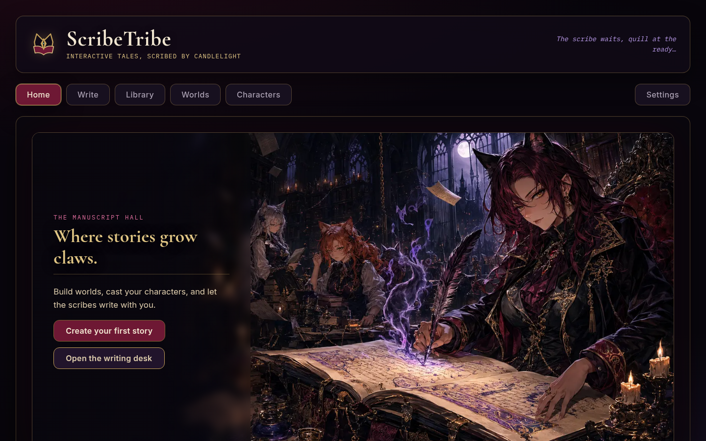
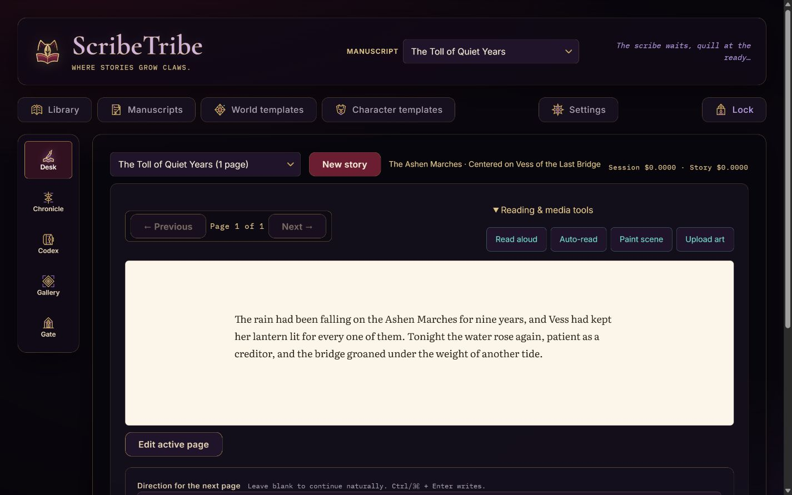
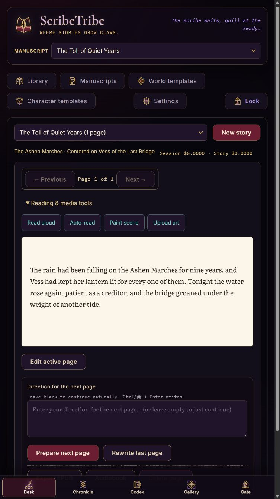
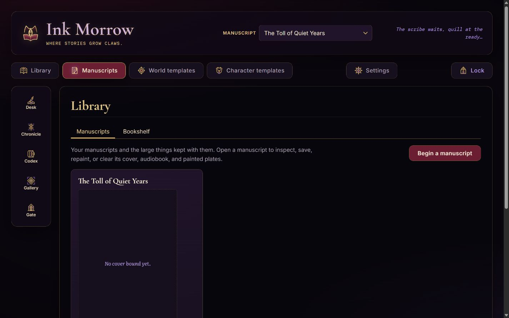
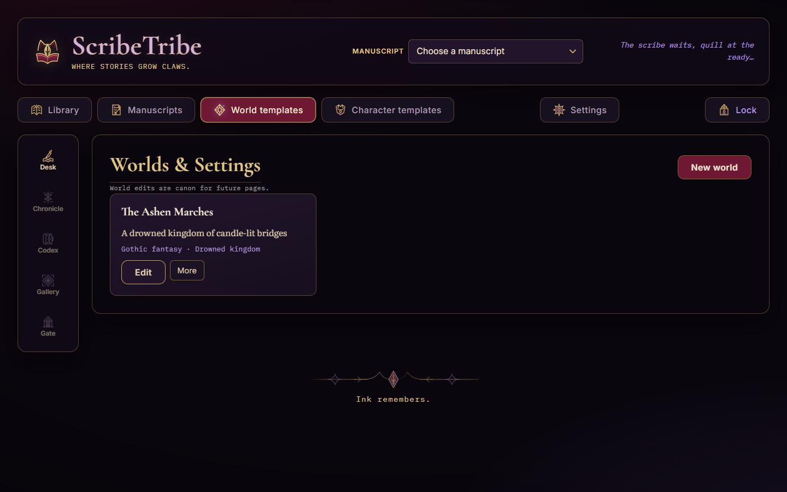

# ScribeTribe

An interactive fiction writing tool with reusable worlds and characters, a gothic web interface, and catgirl scribes. Stories are written **one page at a time** — you give each page a direction, the scribe writes it, then waits for you.

**v3.0.1** is a correctness patch over the v3.0.0 ground-up reorganization: page deletion now renumbers transactionally, every paid action passes an explicit cost review before it fires, the writing desk is truthful when no story is selected, all dialogs share one complete focus/scroll/opener lifecycle, Home's guidance cards and the themed controls render as designed on every viewport, and the dormant auth seam can actually hold rendering back (still no login system — security remains deferred).

**v3.0.0** was the ground-up reorganization itself: a modular backend (feature routers + stores), a native-ES-module frontend with hash routing and a shared dialog system, a Home/Library/Write information architecture, explicit centered/ensemble cast shapes, and honest cost-bearing buttons everywhere — with every API route, data schema, and cost guarantee preserved.

**ScribeTribe is not an erotic-writing tool.** It's a story engine, and its heart is biased toward fantasy — swords, sorcery, shadows, and strange worlds. Mature content is possible if you choose that tone for a story, but that's a setting you control, not the point of the tool.

> [!WARNING]
> **Costs real money — set a spending limit on your API key first.**
>
> ScribeTribe attempts to predict and meter **every** cost involved: pages, retries, narration, reference portraits, world scenes, and scene paintings all carry live estimates and per-generation accounting in the cost ticker. But it is **impossible to make guarantees** — upstream prices change without notice, providers meter their own way, retries happen, and estimates are estimates.
>
> The only real safety is upstream of this app: **create a dedicated OpenRouter API key and set a hard spend limit on it** (OpenRouter lets you cap a key's credit) before you put it in `backend/.env`. Treat anything this app reports as a good-faith tally, not an invoice.

## Screenshots

| Home (desktop) | Writing desk (desktop) |
|---|---|
|  |  |

| Home (tablet portrait) | Writing desk (tablet portrait) |
|---|---|
|  |  |

| Library | Worlds |
|---|---|
|  |  |

## Features

- **Page-by-page interactive generation** — every page stops for your direction, or just hit continue
- **Prepared next page** — while you read, the next page is quietly prepared; the composer says so plainly ("Next page prepared. No cost is booked until you use it."), an empty Write lands instantly, and a direction states that it discards the prepared page. Cost is booked only when you take it
- **Retry last page** — regenerate with the same direction but fresh ink
- **Worlds & characters as first-class, reusable entities** — build a cast once, use it across stories; cross-world casting is supported
- **Explicit cast shapes** — every story declares itself *Centered on a lead* or an *Ensemble* up front, in creation and mid-story editing alike; relation labels follow the named lead (and never mention one that does not exist), the mid-story editor offers direct **Make lead / Switch to ensemble** actions, and an empty cast can add a lead directly — never add-then-promote
- **Cast editing mid-story** — the Library's story cards open a roster/details editor: the roster lists members with roles, cross-world provenance and story-changed markers; the selected member's sheet edits role, starting connection, and the in-story state exactly as the tale has reshaped them. Dirty drafts guard every close, role changes never dump focus or discard local edits, and the base sheets stay untouched
- **Living characters** — per-story mutable state: personality, appearance, and relationships evolve book-paced as pages deal injuries, revelations and betrayals; the base character sheets stay untouched
- **AI fleshing-out** — generate worlds and characters from a few seed words, short/medium/long, regenerate for different takes, edit before saving
- **Reference images** — every world gets a painted establishing scene (no people, no creatures, no action) and every character a reference portrait, generated in the background; existing entries are backfilled on boot, regeneration (with its approximate cost) sits in each card's **More** menu, and creation offers both *Create and paint (≈$…)* and *Create without image*
- **Card editors** — click a world or character to edit it: plain fields, no AI assists, plus the editable blurb sent to the image generator. Worlds carry a **lorebook** — canonical facts honored by every future page (kept out of the creation form on purpose)
- **Canonical worlds** — stories reference the one live world: edit it and future pages follow; world-changing events persist because you decide when they happen. Characters are the opposite — stories hold their own mutable copies
- **Scene illustration** — condense the current page into a tone-honoring image prompt, edit it, then paint it with Grok Imagine through OpenRouter, with the cast's portraits riding along as identity references; the painting opens in a zoomable, pannable popup with ghost Save/Close buttons. Choose 1K·low (fast, ≈$0.04) or 2K·medium (finest, ≈$0.08) before painting. Prompts are composed renderable in every tone — even 18+ implies artfully, since the image model refuses explicit content wholesale. When the moderator refuses, nothing repaints silently: the scribe rewrites the prompt aggressively safe, announces it, puts it back in the box, and waits for your press — and a second refusal drops the cast portraits (paintings made from forced-nudity sheets offend moderation on their own, no matter how clean the text). **Add as page** binds any painting into the story as an image page right after the one it illustrates — a book plate among the prose, later pages renumber, and it travels inside the EPUB export
- **Per-story tone setting** — tasteful (fade-to-black), romantic/sensual, or explicit (18+)
- **Word-target page length** — ask for short or long pages; the token budget scales with it
- **Thinking narrators** — models that can reason before writing expose a reasoning level (low/medium/high) in Settings, with room in the token budget to think
- **Cost awareness** — live session and per-story cost ticker, per-model pricing in the settings picker — good-faith metering of every generation, **not a guarantee** (see the warning above; cap your key). Every paid action — page writes and rewrites, prepared-page follow-ups, narration, auto-read, audiobooks, scene condensing and painting, AI drafts and regenerations, entity portraits and scenes — opens one shared cost review first: what runs, with which model, what is sent, what else gets billed, and an honest estimate (unknown pricing says **price unavailable**, never $0.00). Canceling a review sends nothing and keeps your text; merely selecting a story never spends a cent
- **Low-storage watch** — a persistent amber banner warns when the device's free space runs low (under 1 GB or 5% of the volume), since plates, portraits and the database all grow on the same disk
- **Context windowing** — the AI gets the recent pages verbatim plus a nod to the opening, so long stories don't blow the token budget
- **EPUB export** — download the full story as a valid EPUB e-book, painted plates embedded as book illustrations
- **Read-only history** — earlier pages can't be edited; "Delete later pages" trims the tale through a destructive dialog that names the exact page count and range, and deleting any single page renumbers the rest transactionally (page IDs, prose, and painted plates keep their identity; the numbering stays a contiguous 1..N)
- **Read aloud** — streaming page narration through OpenRouter speech models; playback begins while synthesis is still running, long pages are narrated in sentence-boundary segments, pcm-only narrators (Gemini) are delivered as WAV, Auto keeps turning pages and reading until the tale runs out, and Settings shows each narrator's approximate cost per page alongside honest per-generation cost accounting
- **Audiobooks** — bind the whole tale into one mp3 with the narrator chosen in Settings: a modal advertises the narrator (or why a WAV-only one can't be used) with honest estimates of listening time, file size and cost; the explicit **Create audiobook (≈$…)** button opens the final shared cost review, and confirming starts the reading. The reading's banner tracks progress page by page and becomes a Download when done. Unchanged pages are remembered, so regenerating after edits re-bills only what changed; pcm-only narrators are refused up front
- **Bookshelf** — a shelf of every tale's kept things: bound audiobooks and painted scene plates, downloadable or deletable at any later time
- **Scriptorium typography** — serif typeface presets and a text-size picker for the reading pane
- **One server** — Express serves both the API and the frontend (no CORS, no hardcoded hosts)
- **Quality-guarded generation** — empty, mid-sentence-truncated, or wrong-language model replies never reach the manuscript: bad replies are retried (a language slip gets one explicit "reply in English" nudge), and if the last attempt is still broken the request fails with a clear message and nothing is saved. Pages are held to at least a quarter of the requested length; prompts written in another language on purpose are never second-guessed (the check only fires when your own material is clearly English)
- **One coherent app shell** — Home (the manuscript hall: continue the latest tale, recent manuscripts, the scriptorium path), Write, Library with visible **Stories / Bookshelf** tabs, Worlds, Characters, and Settings as a labelled utility destination; hash routes (`#/write/:story/page/:n`) survive refresh, back/forward, and deep links, with honest recovery when a story no longer exists
- **Shared interaction grammar** — one destructive dialog (object, count, consequence, recoverability) and one paid-action review (price on the button) across the whole app; every dialog — shared or feature modal — traps Tab focus, locks background scroll (counted, released exactly once), restores its opener, and guards dirty drafts through one Escape/backdrop/close policy. An empty writing desk is truthful: "No story selected" instead of a fake page count, every story-dependent control disabled, and the reason in copy
- **Full test suite** — 347 Jest tests (170 backend + 177 frontend) plus Playwright e2e tests, all running against isolated in-memory databases

## Requirements

- Node.js **>= 22.5** (uses the built-in `node:sqlite` — no native builds needed, works great on Termux)
- An [OpenRouter](https://openrouter.ai) API key (or any OpenAI-compatible endpoint)

## Tested on Android / Termux

This tool was **created and tested on an Android tablet running [Termux](https://termux.dev)** — no PC involved. The whole stack (Node server, SQLite database, and the full Jest test suite) runs natively in that environment, and was verified there:

- All 347 Jest tests (170 backend + 177 frontend) pass on-device under Termux
- The server boots, serves the gothic UI, and generates story pages against a live OpenRouter key — all from Termux
- No native module compilation is required at any point (that's why the project uses the built-in `node:sqlite` instead of the `sqlite3` npm package)
- Test scripts invoke Jest as `node node_modules/jest/bin/jest.js`, which sidesteps Termux's broken `.bin` shebangs — `npm test` just works

The Playwright e2e suite also runs on Termux — both projects (desktop and mobile viewports) — using the native Termux Chromium package, since Playwright's browser downloader does not support Android. `AGENTS.md` documents the one-line patch and setup; on a PC it works out of the box.

### Installing on Termux

```bash
pkg update && pkg install nodejs git   # Termux's node is recent; check: node --version
git clone https://github.com/rthorman/scribe-tribe.git
cd scribe-tribe
bash setup.sh
$EDITOR backend/.env                   # set OPENROUTER_API_KEY
./start.sh
```

Then open `http://localhost:3000` in your tablet's browser. To write from another device on the same network, use `http://<tablet-ip>:3000` (the frontend uses relative API URLs, so this works out of the box).

The project was built as an experiment in running AI coding tools natively on Termux — no proot, no root, just the standard on-screen keyboard.

## Quick Start

```bash
git clone https://github.com/rthorman/scribe-tribe.git
cd scribe-tribe

bash setup.sh        # installs deps, creates backend/.env, makes start.sh executable

$EDITOR backend/.env   # set OPENROUTER_API_KEY

./start.sh              # serves app + API on http://localhost:3000
```

Or manually:

```bash
cd backend && npm install
cp .env.example .env    # then edit
npm start               # http://localhost:3000
```

## Configuration (`backend/.env`)

| Variable | Default | Purpose |
|---|---|---|
| `OPENROUTER_API_KEY` | — | **Required** for AI generation. Use a **dedicated key with a hard spend limit** — the app meters costs in good faith but cannot guarantee them |
| `OPENROUTER_BASE_URL` | `https://openrouter.ai/api/v1` | Any OpenAI-compatible endpoint |
| `OPENROUTER_MODEL` | `z-ai/glm-5.1` | Model used for pages |
| `PORT` | `3000` | Server port (app + API together) |
| `HOST` | `0.0.0.0` | Bind address; set `127.0.0.1` to expose localhost only |
| `DB_PATH` | `../database/scribe-tribe.db` | SQLite file; `:memory:` for ephemeral runs |
| `AI_MAX_TOKENS` | `1500` | Cap per generated page |
| `AI_RETRY_BASE_DELAY` | `800` | Backoff base for transient AI errors |
| `AI_TIMEOUT_MS` | `120000` | Per-request AI timeout
| `IMAGE_MODEL` | `x-ai/grok-imagine-image-2.0` | Image model for reference portraits and scene paintings
| `IMAGE_TIMEOUT_MS` | `180000` | Per-request image generation timeout
| `CONTEXT_WINDOW` | `5` | Recent pages sent verbatim to the AI |

## How It Works

1. **Worlds** — define settings, genres, lore
2. **Characters** — personalities, appearances, backgrounds; bound to a world or free-roaming
3. **Stories** — pick a world, cast characters, choose a tone
4. **Write** — give each page a direction (or leave it blank to just continue); retry or delete pages; export when it's done

## Project Structure

```
scribe-tribe/
├── backend/
│   ├── server.js              # entry: config, listen, graceful shutdown
│   ├── src/
│   │   ├── app.js             # composer: middleware, runtime, router mounting, disposal
│   │   ├── db.js              # node:sqlite schema, WAL, FK enforcement, migrations
│   │   ├── ai.js              # OpenAI-compatible client with retry/backoff + catalogs
│   │   ├── prompt.js          # prompt builder (tone, cast tiers, relations, state)
│   │   ├── quality.js         # reply quality guards (empty/truncated/language)
│   │   ├── epub.js            # dependency-free EPUB/ZIP writer
│   │   ├── images.js          # OpenRouter Image API client (Grok Imagine) + disk store
│   │   ├── core/              # http + validation helpers shared by all routers
│   │   └── modules/           # feature routers/stores/services:
│   │       ├── catalog/       #   worlds + characters CRUD, generate_image field
│   │       ├── stories/       #   story/page/preview SQL, cast contract
│   │       ├── writing/       #   drafts, generate/regenerate/preview orchestration
│   │       ├── imagery/       #   scene painting, moderation flow, entity queue
│   │       ├── audio/         #   narration cache/segments, audiobook queue
│   │       ├── library/       #   storage aggregation + EPUB download
│   │       └── auth/          #   disabled adapter seam (security deferred)
│   └── tests/                 # Jest + supertest (170 tests)
├── frontend/
│   ├── index.html             # semantic shell, mount points, dialog templates
│   ├── app/                   # native ES modules — no build step
│   │   ├── bootstrap.js       # one context, feature composition, startup
│   │   ├── core/              # api, router (hash), state, dom, dialogs, notifications,
│   │   │                      #   cost (the shared paid-review grammar)
│   │   ├── components/        # shared catalog card anatomy
│   │   ├── shell.js           # section switching, scribe status, disk banner
│   │   └── features/          # home, worlds, characters, settings, ai-drafts,
│   │                          #   library/ (tabs, stories, story-editor, bookshelf),
│   │                          #   write/ (index, generation, narration, imagery, audiobook),
│   │                          #   auth/ (disabled adapter + dormant gate)
│   ├── styles/                # tokens, base, shell, components, features
│   ├── brand/                 # production art assets (WebP + SVG only)
│   └── tests/                 # Jest + jsdom (177 tests, native ESM)
 ├── e2e/                   # Playwright browser tests (chromium + mobile)
 ├── database/              # runtime storage, gitignored: SQLite file,
 │                          #   images/ (portraits + scene plates), audio/ (audiobooks)
 ├── ScribeTribe-OpenCode-Branding/  # branding package: specs + art masters
├── .github/workflows/      # CI: Jest + Playwright on every push
├── setup.sh
├── start.sh               # convenience launcher
├── .nvmrc                 # pins Node >= 22.5 (node:sqlite)
├── CODE_OF_CONDUCT.md
└── LICENSE
```

## API

| Method | Route | Purpose |
|---|---|---|
| GET/POST | `/api/worlds` | List / create worlds |
| GET/PUT/DELETE | `/api/worlds/:id` | Fetch / update / delete (409 if in use) |
| GET/POST | `/api/characters` | List (filter by `?world_id=`) / create |
| GET/PUT/DELETE | `/api/characters/:id` | Fetch / update / delete (removed from casts) |
| GET/POST | `/api/stories` | List (with parsed cast + page counts) / create |
| GET/PUT/DELETE | `/api/stories/:id` | Fetch / update (title, world, tone, cast) / delete |
| GET/POST/DELETE | `/api/stories/:id/pages[/:n]` | List / add / delete pages (deleting one renumbers later pages down, transactionally) |
| DELETE | `/api/stories/:id/pages?after=N` | Burn every page after N (destructive dialog in the UI) |
| POST | `/api/stories/:id/pages/generate` | AI-generate the next page (saves it) |
| POST | `/api/stories/:id/pages/regenerate` | Rewrite the last page, same direction |
| POST | `/api/stories/:id/pages/preview` | Prepare the next page ahead of time (nothing saved until committed). The client only calls this as a disclosed follow-up of a confirmed action — never on passive story selection |
| POST | `/api/stories/:id/pages/commit-preview` | Save the prepared page and book its cost |
| POST | `/api/stories/:id/pages/:n/image-prompt` | Condense the page into a tone-honoring image-generation prompt |
| POST | `/api/stories/:id/pages/:n/scene-image` | Paint the scene (cast portraits as identity references; render=low_1k\|medium_2k; drop_references=true omits them). A moderation refusal returns `{refused, reason, sanitized_prompt}` instead of repainting — the client announces and waits for a fresh press |
| POST | `/api/stories/:id/pages/:n/image-page` | Bind a painted scene into the story as an image page right after page N (later pages renumber); body: `{image (base64), media_type, prompt?, cost_usd?}` |
| GET | `/api/stories/:id/pages/:n/image` | Fetch the painted plate of an image page (404 for text pages) |
| GET/POST | `/api/characters/:id/image` | Fetch the reference portrait / regenerate it in the background |
| GET/POST | `/api/worlds/:id/image` | Fetch the world scene / regenerate it in the background |
| GET | `/api/stories/:id/export` | Download the full story as an EPUB |
| GET | `/api/disk` | Free/total bytes of the filesystem holding the plates (for the low-storage banner) |
| POST/GET/DELETE | `/api/stories/:id/audiobook` | Start (one global queue, rejects pcm-only narrators) / poll (status, progress, staleness, queue position) / remove a whole-story mp3 |
| POST | `/api/stories/:id/audiobook/cancel` | Stop the pending or running reading |
| GET | `/api/stories/:id/audiobook/audio` | Download the finished audiobook (attachment) |
| GET | `/api/storage` | Every tale's kept things (audiobook meta + scene plates) for the Bookshelf |
| GET | `/api/models` | OpenRouter model catalog with pricing (for the settings picker) |
| POST | `/api/ai/world` | Flesh out a world from seeds (short/medium/long) |
| POST | `/api/ai/character` | Flesh out a character from seeds (world-aware) |
| GET | `/api/speech-models` | OpenRouter speech-model catalogue with voices + per-char pricing (for Narration settings) |
| POST | `/api/stories/:id/pages/:n/narrate` | Stream the page as speech (binary pass-through, cache-aware) |
| GET | `/api/ai/generation-cost?id=` | Authoritative cost for a narration generation |

All validation errors return `400` with a helpful message; unknown ids return `404`.

## Testing

```bash
npm run lint         # ESLint over backend, frontend and e2e (CI runs it first)
npm test             # lint + backend (170) + frontend (177) Jest suites — runs on Termux too
npm run test:coverage
npm run test:e2e     # Playwright (chromium + mobile), desktop or Termux
# frontend Jest runs native ESM: cd frontend && npm test (uses --experimental-vm-modules)
# first run on a new machine: cd e2e && npm install && npm run install-browsers
```

- Backend tests run against **in-memory databases** — they never touch your real data
- AI calls are **mocked** in unit/integration tests, so they're fast and free
- E2E tests run against a real server with the AI endpoint mocked at the network layer
- Transient AI failures are covered by retry/backoff tests
- The Jest and Playwright suites were developed and verified on Android/Termux (e2e via the native Chromium package)
- All commands invoke their tools as `node node_modules/…/bin/…`, sidestepping Termux's broken `.bin` shebangs

## Creator's Note

ScribeTribe was born on a very budget Android tablet. Not a modest laptop, not a spare machine — a cheap tablet, using nothing but the standard on-screen keyboard, just to show it's doable. I installed the entire tool suite right there: Termux, Node, git. Then I built this whole project in that environment — server, database, gothic frontend, and the full test suite — all written, run, and verified on-device.

The whole thing was finished in one afternoon, while my wife was out having lunch with her friends. By the time she got home, the scribes were already purring.

You don't need a workstation to build software. You need a story you want to tell and a few free hours.

Ok, ok, so I continued into the night. I did. Its fun. And yes, the wife loves the stories.

Credit where due: the code was written in partnership with [OpenCode](https://opencode.ai) running natively on Termux, powered by GLM-5.3 (Z.ai); ScribeTribe's branding concept, art direction, design system, implementation brief, and visual assets were developed collaboratively with [OpenAI Codex in ChatGPT](https://openai.com/codex/) (GPT‑5‑based), and the visual assets were created using OpenAI image-generation tools — see [CREDITS.md](./CREDITS.md).

## License

[MIT](./LICENSE)

## Contributing

PRs welcome. Keep the gothic theme, keep the test suite green (CI runs the Jest suites **and** the Playwright e2e job), and add tests for new features. By participating you agree to abide by the [Code of Conduct](./CODE_OF_CONDUCT.md).