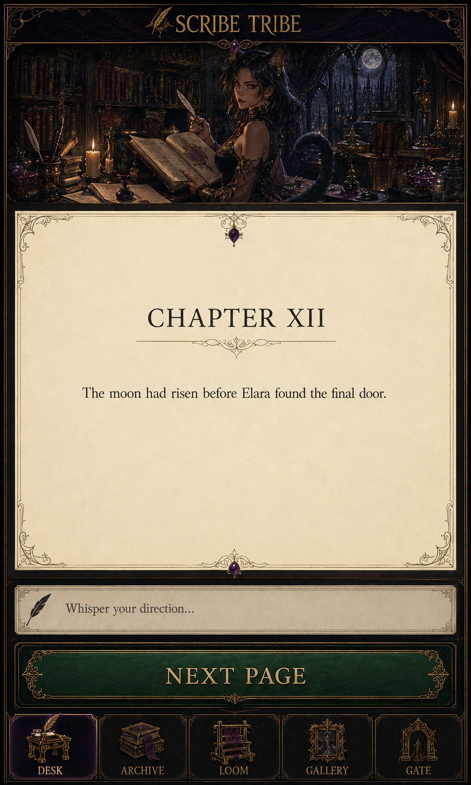

# Ink Morrow 4.0.0 art direction

Status: **approved**
Reference role: **atmosphere and visual-language anchor, not a literal screen
layout**

## Brand statement

Darkly gothic, fantastical, sensually provocative, centered around a mythical
Scriptorium inhabited by a tribe of mysterious adult catgirl scribes who live
for the Story.

The Scriptorium is not a cute mascot wrapper. It is a seductive, serious place
of authorship: nocturnal, literate, intimate, slightly dangerous, and wholly
devoted to narrative craft.

## Approved reference

This is the approved first portrait concept. A later variant that increased
exposure was rejected. Do not use “more provocative” as a general instruction
to reveal more skin. The approved balance is the target.

## Visual character

- **Darkly gothic:** carved stone and wood, iron, pointed arches, manuscript
  illumination, velvet darkness, candle and moonlight.
- **Fantastical:** feline ears and tail, impossible archives, magical ink,
  subtle constellations, living script, and a tribe with distinct roles.
- **Sensually provocative:** confident gaze, posture, silhouette, tactile
  materials, closeness, implication, decadent detail, and self-possession.
- **Story-centered:** manuscripts, books, ink, annotation, binding, reading, and
  memory are always more important than pin-up display.
- **Contemporary product:** clear hierarchy, modern spacing, disciplined
  controls, responsive composition, and calm reading surfaces.

All recurring scribe characters are unmistakably adults.

## The tribe

The scribes may embody product functions, but characters must not make controls
less literal:

- **Scribe:** prose, invention, and the waiting next page;
- **Archivist:** continuity, evidence, memory, and correction;
- **Binder:** volumes, chapters, exports, and project archives;
- **Illuminator:** generated and uploaded art; and
- **Warden:** threshold, privacy, lock, and sharing.

These are art and supporting-copy roles, not mandatory navigation labels.

Each scribe should have a distinct silhouette, ear/tail language, clothing,
palette bias, working tools, and temperament. Avoid a collection of
near-identical faces with different hair colors.

## Palette roles

| Role | Direction |
|---|---|
| Foundation | Near-black ink, black plum, smoked charcoal |
| Depth | Aubergine, bruised violet, midnight blue |
| Heat | Oxblood, dark wine, garnet |
| Guidance | Antique gold, candle amber, muted brass |
| Manuscript | Warm vellum, bone, parchment grey |
| Speculative state | Verdigris or moonlit green, reserved for the prepared-page action |
| Danger | Distinct red with sufficient contrast, never confused with wine ornament |

Exact production tokens are selected with contrast testing. The green prepared
state is semantic and scarce; decorative green must not compete with **Next
Page**.

## Light and material

The signature light is warm task light against cool nocturnal depth. Use gold
rim light, controlled bloom, sharp illuminated details, and generous shadow.

Materials are tactile: vellum, ink, leather, velvet, tarnished metal, carved
wood, old stone, and glass. Digital surfaces may borrow their color and edge
language but must not become skeuomorphic puzzles.

## Composition

- Prefer portrait compositions that respect tablet proportions.
- Keep the first meaningful action within the initial viewport.
- Establish one strong focal scribe or manuscript, then a clear route to the
  control.
- Preserve negative space for real UI; do not bake illegible fake text into
  production artwork.
- Use foreground objects sparingly to create intimacy without obscuring touch
  targets.
- The manuscript itself uses a quiet flat or subtly textured surface with no
  figure behind it.

## Sensuality boundary

Provocation comes from agency, mood, gaze, luxurious fabric, fitted
silhouettes, exposed shoulder or back, poised movement, and the charged privacy
of the Scriptorium. It does not require increased nudity, fetish-costume
shorthand, infantilization, exaggerated anatomy, or poses that make writing
physically implausible.

The user may author and upload whatever lawful fictional imagery they choose.
This boundary governs official brand assets, not user content.

## UI application

| Surface | Brand intensity | Art use |
|---|---|---|
| First run / unlock | Very high | Full portrait threshold with calm auth panel |
| Library | High | Strong environmental framing, covers, character moments |
| New manuscript | Medium-high | One guiding scribe, clean one-sheet controls |
| Desk | Low around prose | Edge atmosphere, subtle tools, no art behind manuscript |
| Chronicle / Codex | Medium | Archival motifs and restrained character cameos |
| Gallery | High | Illuminator presence and media-first layout |
| Gate | Medium-high | Binding, sealed folios, thresholds and publication |
| Destructive / legal / security dialogs | Low | Clarity only; ornament cannot soften consequence |

## Typography

- Cormorant Garamond: display names, thresholds, ceremonial headings.
- Literata: manuscript, excerpts, long reading.
- Inter or Source Sans: controls, settings, state, helper text.
- IBM Plex Mono: model identifiers, diagnostics, technical metadata.

Decorative capitals are for short display text only. Body copy, form labels,
errors, legal notices, and destructive consequences use clear sentence case.

## Image-generation brief for future official assets

Every prompt should establish:

- an adult catgirl scribe with a concrete Scriptorium role;
- a real act of reading, writing, cataloguing, illuminating, guarding, or
  binding;
- dark gothic fantasy with warm candle gold against cool plum and moonlight;
- confident, sensually charged presence without increasing exposure beyond the
  approved reference;
- anatomically plausible hands, ears, tail, tools, and posture;
- portrait-tablet composition with intentional UI-safe negative space; and
- no logos, watermarks, fake readable interface text, or generic neon
  cyberpunk.

Generate art without final UI chrome. Layout, controls, type, responsive
behavior, and accessibility remain native HTML/CSS.

## Avoid

- cute chibi mascot language;
- generic anime pin-up composition;
- grimdark mud with no readable hierarchy;
- purple neon dashboards unrelated to manuscripts;
- ornate frames around every control;
- texture behind long-form prose;
- corset-and-cat-ears sameness across the tribe;
- leashes or coercive pet framing. Moth's approved narrow velvet bell collar is
  a deliberate archivist character detail, not a general tribe motif;
- ambiguous fantasy verbs for paid, destructive, or security actions;
- fake parchment that reduces contrast; and
- treating the approved reference as a pixel-perfect page specification.

## Asset handling

The approved PNG is a planning reference and is not automatically a production
runtime asset. A future UI PR may crop, derive, or replace production artwork
only if the result preserves this direction and receives visual review at the
critical responsive profiles.

Production derivatives should use efficient modern formats, preserve an
archival source, include useful alt text when semantically meaningful, avoid
embedding sensitive metadata, and declare their generation credit in
[../../../CREDITS.md](../../../CREDITS.md).
